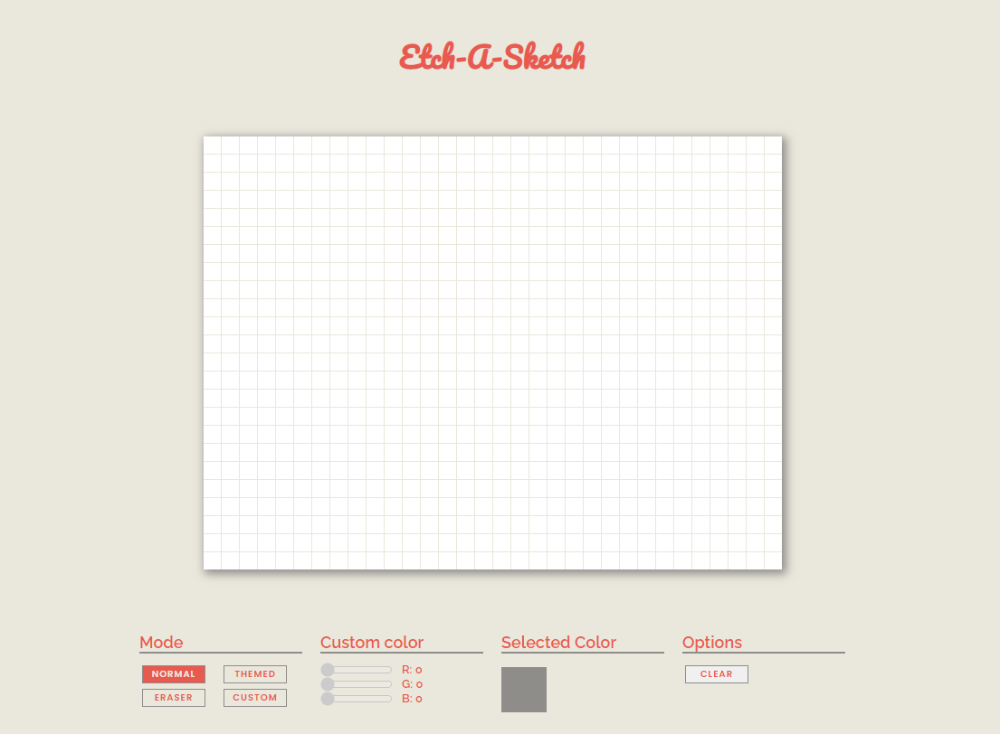

# odin-etch-a-sketch

The second Javascript project on theodinproject.com.
This Etch-A-Sketch lets you color squares in a 32x14 grid.
It lets you choose a custom color with RGB sliders and has a themed rainbow mode.
Some neat things I integrated are:
- you have to hold the mouse button down to color, just hovering over the squares is not enough
- the rainbow mode does not pick colors from the array randomly but in a fixed order looping back in reverse
- the color preview will always show you the active color, no matter what mode is selected and updates in real time

I could have used a ``<input type="color">`` element for a quick and easy color selection but it doesn't really fit into the UI 
and integrating sliders manually was a good learning experience. 

In this project I learned a lot about manipulating DOM elements and their properties with Javascript and using Event Listeners to make 
the application react dynamically to the users inputs.
